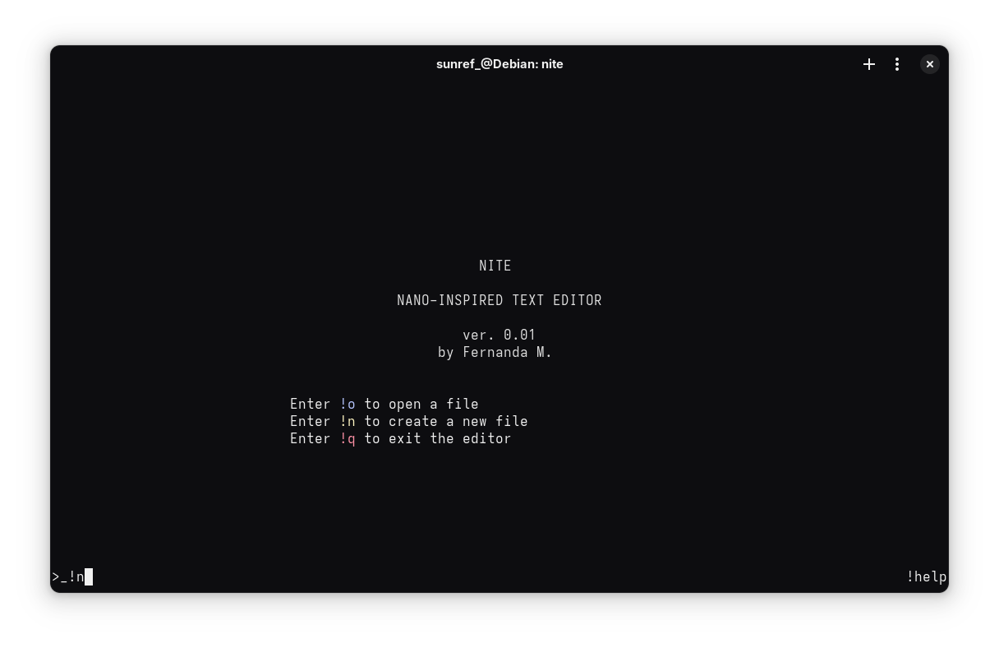

```
 _   _ ___ _____ _____ 
| \ | |_ _|_   _| ____|
|  \| || |  | | |  _| 
| |\  || |  | | | |___
|_| \_|___| |_| |_____|

```
NITE (*Nano-Inspired Text Editor*) is a minimalist terminal text editor written in **C**, focused on simplicity.
Inspired by the **nano** editor, NITE provides an intuitive and efficient interface for editing files directly in the terminal.



## Features
- Simple and clean terminal interface.
- Keyboard shortcuts inspired by **nano** and **vim**.
- Support for creating and editing text files.
- Written in **C** for maximum performance.
